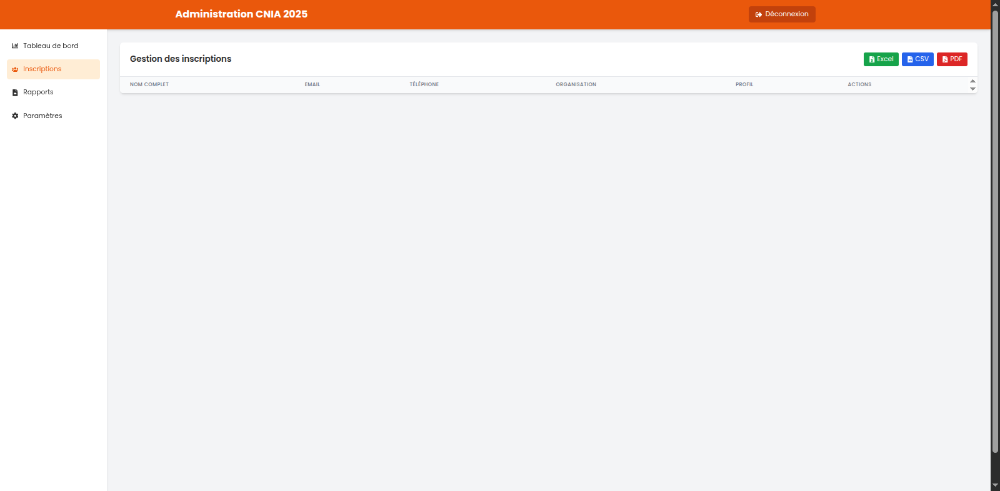
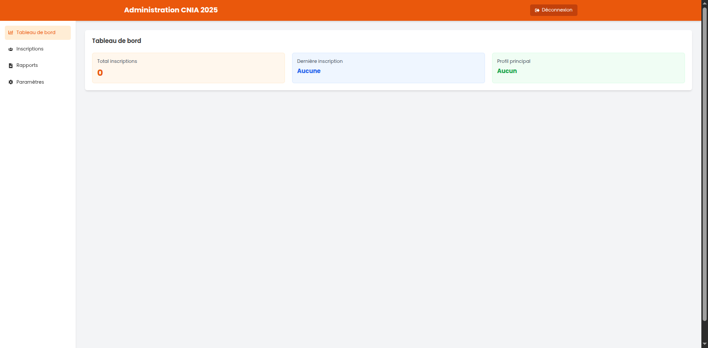
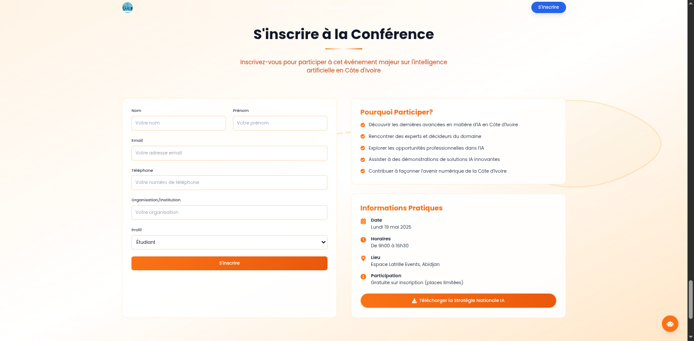
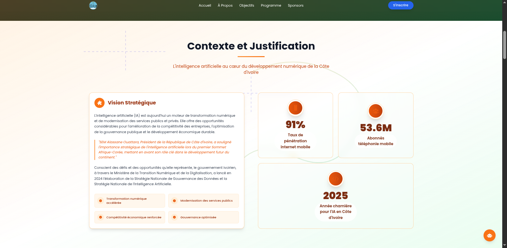

# CNIA 2025 - Plateforme d'Inscription

## Description du Projet
Application web pour la Conférence Nationale sur l'Intelligence Artificielle (CNIA) 2025.  
Permet l'inscription en ligne des participants et la gestion administrative via un espace sécurisé.

## Architecture Technique

### Backend
- **Technologies** : Node.js, Express, Sequelize, MySQL
- **Authentification** : JWT (JSON Web Tokens)
- **API REST** : Endpoints pour l'inscription et l'administration
- **Base de données** : Modèles User et Registration

### Frontend
- **Framework** : React avec Vite
- **Styling** : TailwindCSS
- **Routing** : React Router
- **Composants** : Formulaire d'inscription, Chatbot, Interface Admin

## Fonctionnalités Principales

- ✅ Inscription en ligne avec validation
- 🔐 Espace d'administration sécurisé
- 🤖 Chatbot d'assistance intégré
- 📱 Interface responsive (mobile & desktop)
- 📊 Export des données en PDF/Excel

## Installation

### Prérequis
- Node.js v18+
- MySQL 8.0+

### Backend
```bash
cd backend
npm install
npm start
```

### Frontend
```bash
cd cnia-react
npm install
npm run dev
```

## Configuration

Créer un fichier `.env` dans le dossier backend :

```env
DB_HOST=localhost
DB_USER=root
DB_PASS=votre_mot_de_passe
DB_NAME=cnia_2025
JWT_SECRET=secret_key_cnia_2025
PORT=5000
```

## Captures d'écran

| Page d'accueil | Formulaire d'inscription |
|----------------|--------------------------|
|  |  |

| Interface admin | Chatbot | Version mobile |
|----------------|---------|----------------|
|  |  |  |

## Structure des Fichiers

```
backend/
  ├── config/       # Configuration DB
  ├── models/       # Modèles Sequelize
  ├── routes/       # Contrôleurs API
  └── server.js     # Point d'entrée

cnia-react/
  ├── public/       # Assets statiques
  └── src/
      ├── assets/   # Images/SVG
      ├── components/ # Composants React
      └── App.jsx   # Composant principal
